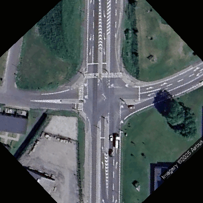

# Satellite imagery

## How to use

1. Set up Google Cloud account to receive API key and secret
2. Get satellite imagery from Google Maps API using `get_sat_image()`. Parameters:
    - `lat` and `lon` are the latitude and longitude of the center of the image.
    - (Optional) `zoom` is the zoom level of the image. Default: `15`
    - `secret` is the secret key for the Google Maps API.
    - (Optional) `print_url` is a boolean to print the URL of the image. Default: `False`

    return: `requests.Response` object.

3. Save image to using `save_sat_image()`. Parameters:
    - `response` is the response object from `get_sat_image()`.
    - (Optional) `filename` is the name of the file to save the image to. Default: `map.png`

4. (Optional) Rotate image using `rotate_image()`. Parameters:
    - `image_path` is the name of the file to rotate.
    - `angle` is the angle to rotate the image by.


## Results

```python
response = get_sat_image(55.780001, 9.717275, secret="...")
save_sat_image(response)
rotate_image("map.png", 45)
```
yields


## Requirements
Required python libraries are:
```
pip install hashlib, hmac, base64, urllib, requests, yaml, PIL
```